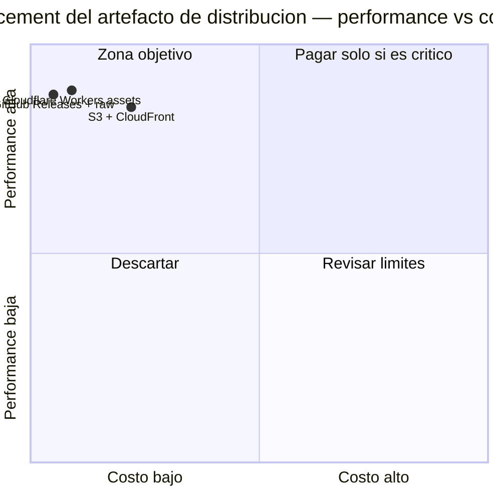

# ADR-0009: Placement de despliegue — artefacto de distribución y CD

* **Estado:** accepted
* **Fecha:** 2026-08-30
* **Decisores:** Jeremi Alcala
* **Fase AI-DLC:** 02-design
* **Versión:** 1.0.0
* **ID:** ADR-0009
* **Supersede / Superseded-by:** —
* **Controles OWASP afectados:** A02 (TLS y configuración del origen), A03 y A08 (integridad del canal de distribución)

> Nota de ubicación: la guía de deployment placement propone
> `docs/02-design/adr/ADR-NNN-placement-<componente>.md`. Este repositorio mantiene **un único
> registro de ADRs** en `docs/00-project/adr/` para no fragmentar la numeración, siguiendo la
> convención ya usada en otros repositorios de Higerotech. El contenido sigue la plantilla de
> la guía sin cambios.

## Contexto

**Componente desplegable:** el artefacto de distribución del instalador — un único fichero de
texto de ~22 KB (`install-docker.sh`) más su `SHA256SUMS`, servido por HTTPS a servidores que
lo descargan con `curl`.

**Clasificación (guía de placement, paso 1): perfil A — estático puro.** No hay cómputo por
petición, ni estado, ni sesión. Es un fichero.

**Tráfico esperado a 12 meses:** el parque de Higerotech ronda las 20 máquinas, con
aprovisionamientos y re-ejecuciones de convergencia. Estimación generosa: **500 descargas/mes**
× 22 KB ≈ **11 MB/mes** y 500 peticiones/mes. Incluso multiplicando por 100 seguiría siendo
tráfico irrelevante para cualquier proveedor.

**Restricciones:**
- El artefacto debe vivir donde vive el código y su historial, porque la integridad depende de
  que el tag y el fichero servido sean la misma cosa (ADR-0002).
- La URL debe ser estable y citable en runbooks durante años.
- Geografía de los usuarios: servidores de Higerotech, sin requisito de latencia estricto —
  una descarga de 22 KB no tiene un problema de latencia percibida.

**Segundo componente a decidir:** el CD que publica ese artefacto.

## Candidatos evaluados

| Criterio (peso) | GitHub Releases + raw | Cloudflare Workers (assets estáticos) | AWS S3 + CloudFront |
|---|---|---|---|
| Latencia percibida (30%) | 4 | 5 | 5 |
| Escalabilidad sin intervención (20%) | 5 | 5 | 5 |
| Cold start / SLA (15%) | 4 | 5 | 5 |
| Límites técnicos (15%) | 4 | 4 | 4 |
| Carga operativa (20%) | 5 | 3 | 2 |
| **Score_perf** | **4.40** | **4.45** | **4.25** |
| **Costo est. USD/mes** | **$0** | **$0** | **$0** |
| **PxD** | **44.0** | **44.5** | **42.5** |

### Costos: fuentes verificadas el 2026-08-30

| Servicio | Precio aplicable a este componente | Fuente |
|---|---|---|
| GitHub (repo público) | $0 — alojamiento de repositorio, releases y `raw` sin coste | [Pricing changes for GitHub Actions (2026)](https://github.com/resources/insights/2026-pricing-changes-for-github-actions) |
| GitHub Actions | $0 — gratis e **ilimitado** en repositorios públicos. En privado: 2.000 min Linux/mes y $0.006/min extra tras el recorte del 2026-01-01 | [GitHub Changelog, 2025-12-16](https://github.blog/changelog/2025-12-16-coming-soon-simpler-pricing-and-a-better-experience-for-github-actions/) |
| Cloudflare Workers (free) | $0 — **los assets estáticos son gratuitos e ilimitados** y no consumen las 100.000 peticiones/día del plan | [Cloudflare Workers pricing](https://developers.cloudflare.com/workers/platform/pricing/) |
| AWS S3 Standard | $0.023/GB/mes (us-east-1, primeros 50 TB) → 22 KB ≈ **$0.000001/mes** | Tarifas S3 vigentes Q2 2026 |
| AWS CloudFront | $0.085/GB (primeros 10 TB, US/EU) + $0.0004 por 1.000 GET; **capa Always Free: 1 TB de salida y 10 M peticiones/mes** → este tráfico cae íntegro dentro | Tarifas CloudFront vigentes Q2 2026 |

**Los tres candidatos cuestan $0/mes a este volumen.** Con costo normalizado a 1 USD, el PxD
queda dominado por el `Score_perf` y los tres quedan dentro de un **4,7% de diferencia**, muy
por debajo del umbral del 15% que la guía define como empate.

Aplica por tanto el **criterio de desempate documentado: gana el de menor carga operativa.**

*Caption — eje trazabilidad, fase 02-design: los tres candidatos caen en la zona objetivo. Cuando
el costo es cero para todos, el PxD deja de discriminar y decide la carga operativa.*

## Decisión

**Runtime del artefacto: GitHub Releases + `raw.githubusercontent.com` sobre el repositorio
público.**

**CD: GitHub Actions** (`.github/workflows/release.yml`), disparado por tags `v*.*.*`.

Razones, en orden de peso:

1. **Carga operativa cero, y no por casualidad.** El artefacto ya está en GitHub porque el
   código está en GitHub. Cualquier otro candidato exige *copiar* el fichero a un segundo
   sitio, y eso introduce una clase de fallo que hoy no existe: que lo publicado divirja de lo
   etiquetado. Para un artefacto cuya seguridad se basa en "el tag y el fichero son la misma
   cosa" (ADR-0002), duplicar el origen es un retroceso de seguridad, no una mejora de
   rendimiento.

2. **El criterio de latencia no aplica de forma significativa.** Los 0,6 puntos de ventaja de
   Cloudflare en latencia se refieren a TTFB de decenas de milisegundos sobre una descarga de
   22 KB que ocurre una vez por servidor. No es un sitio web con usuarios esperando.

3. **La regla de proporcionalidad de la guía.** Candidato claro y costo por debajo de $10/mes:
   no se justifica invertir en una arquitectura de distribución más elaborada.

4. **CD: la tabla de la guía lo resuelve directamente.** El pipeline tiene pruebas y lint
   (ShellCheck, matriz en contenedores, gitleaks, validación de Mermaid), luego corresponde
   GitHub Actions y no Workers Builds — que además no aplica, porque no hay ningún componente
   en Cloudflare. Al ser el repositorio público (ADR-0002), Actions es gratuito e ilimitado.
   Montar CodePipeline "por consistencia" sería exactamente la antirregla que la guía advierte.

## Consecuencias

- **Positivas:** costo total $0/mes. Una sola fuente de verdad para código y artefacto. La URL
  del tag es estable y citable. El workflow puede además **verificar** que el tag coincide con
  `SCRIPT_VERSION` y que existe la entrada en el `CHANGELOG.md`, algo que un CDN externo no
  podría hacer.
- **Negativas / deuda asumida:**
  - **Dependencia total de GitHub**: si GitHub tiene una incidencia, no se pueden aprovisionar
    servidores nuevos. Aceptado — el impacto es un retraso, no una caída de producción.
  - `raw.githubusercontent.com` no ofrece SLA público ni dominio propio. Si en el futuro se
    quisiera un `get.higerotech.com`, entraría Cloudflare Workers como front, y esta ADR
    debería revisarse.
  - `raw.githubusercontent.com` aplica límites de tasa no documentados. A 500 descargas/mes es
    irrelevante; a escala de CI masivo dejaría de serlo.
  - Lock-in bajo: mover el artefacto a otro origen es copiar un fichero y cambiar una URL.
- **Impacto en threat model:** refuerza T1/T2 al mantener una sola fuente de verdad. Introduce
  la dependencia de disponibilidad de GitHub, que no es una amenaza de seguridad sino de
  continuidad.

## Condiciones de revisión

- Tráfico ×10 sostenido, o adopción del instalador fuera de Higerotech.
- Necesidad de un dominio propio (`get.higerotech.com`) para la URL de instalación.
- Cambio de precios o de política de acceso de GitHub a `raw.githubusercontent.com`.
- Aparición de un requisito de SLA sobre la disponibilidad del instalador.
- **Caducidad de los precios de esta ADR: 2027-02-28.** Reverificar antes de esa fecha.
