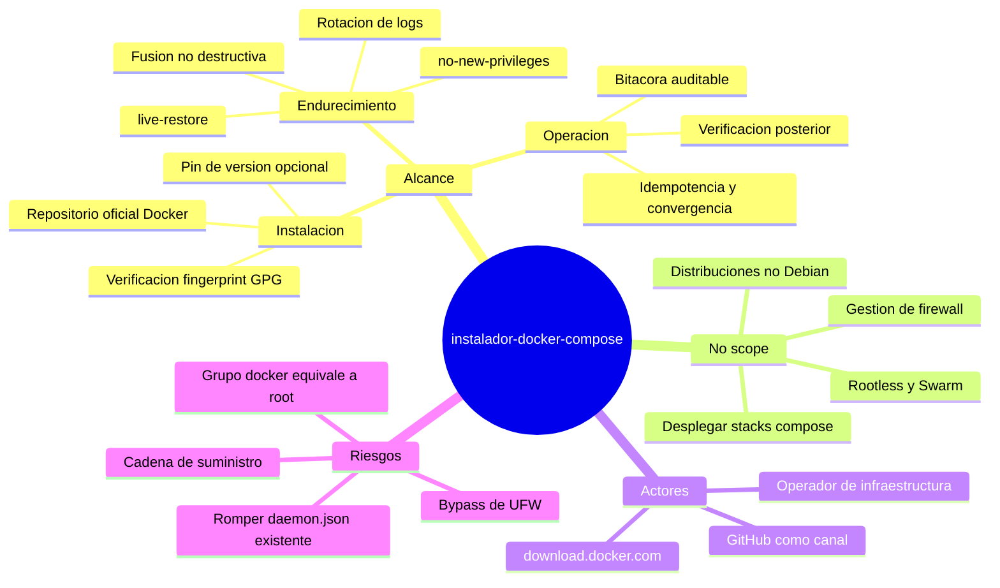

# Project Charter — instalador-docker-compose

* **Estado:** approved
* **Fecha:** 2026-08-30
* **Decisores:** Jeremi Alcala
* **Fase AI-DLC:** 00-project
* **Versión:** 0.1.0
* **Sponsor:** Higerotech
* **Owner del proyecto:** Jeremi Alcala

## Visión

Que cualquier servidor base Debian o Ubuntu de Higerotech quede con Docker Engine y el
plugin Compose instalados **desde el repositorio oficial, endurecidos y de forma auditable**,
con un solo comando reproducible que el operador pueda verificar antes de ejecutarlo como root.

El problema que resuelve: hoy la instalación se hace a mano o copiando fragmentos de la
documentación de Docker. Eso produce servidores con versiones distintas, sin rotación de logs,
con el usuario en el grupo `docker` sin decisión consciente, y sin ninguna traza de qué se
instaló ni cuándo.

## Alcance

**Incluye:**

- Un único script `install-docker.sh`, ejecutable vía `curl | sudo bash`, idempotente y
  convergente (una segunda ejecución revisa configuración, no reinstala).
- Instalación desde el repositorio APT oficial de Docker, con **verificación del fingerprint
  de la llave GPG** antes de confiar en él.
- Perfil de endurecimiento del daemon (`/etc/docker/daemon.json`) aplicado por fusión **no
  destructiva** sobre la configuración existente.
- Fijado opcional de versión de Docker Engine para mantener la flota homogénea.
- Gestión **opt-in explícita** de la pertenencia al grupo `docker`.
- Verificación posterior a la instalación y smoke test opcional.
- Distribución versionada: tag SemVer inmutable + `SHA256SUMS` publicado en la release.
- CI con ShellCheck, validación de diagramas, matriz de ejecución en contenedores y escaneo
  de secretos.

**No incluye (no-scope):**

- Desplegar stacks de aplicación con `docker compose up` — el proyecto instala el motor, no
  opera cargas. Sería un ciclo AI-DLC posterior con su propio Gate 0.
- Docker rootless, Swarm y Kubernetes (ver ADR-0006 para rootless).
- Gestión de registries privados, credenciales de registry o `docker login`.
- Distribuciones fuera de la familia Debian (RHEL, Alpine, Arch), Windows y macOS.
- Gestión del firewall del host: el instalador **advierte** del bypass de UFW (T6) pero no
  modifica reglas, porque hacerlo a ciegas rompería la conectividad de servidores en uso.
- Actualización automática de Docker: es responsabilidad de `unattended-upgrades` del host.

## Mapa mental del alcance

*Caption — eje trazabilidad, fase 00-project: alcance, actores y riesgos de alto nivel.*

## Stakeholders

| Rol | Nombre | Responsabilidad |
|---|---|---|
| Sponsor / Owner | Jeremi Alcala | Decide alcance, cierra gates, aprueba ADRs |
| Operador de infraestructura | Equipo Higerotech | Ejecuta el instalador en los hosts destino |
| Mantenedor del repositorio | Jeremi Alcala | Revisa PRs, corta tags, publica releases |
| Consumidor indirecto | Proyectos desplegados sobre esos hosts | Heredan la configuración del daemon |

## Restricciones y supuestos

- **R1.** Los hosts destino tienen salida HTTPS hacia `download.docker.com`, el archivo APT de
  su distribución y (para el smoke test) `registry-1.docker.io`.
- **R2.** El operador dispone de `sudo` o acceso root en el host.
- **R3.** Los servidores reales ejecutan systemd. En contenedores o WSL sin systemd el script
  instala pero no habilita el servicio, y lo advierte.
- **S1.** El repositorio es público (ADR-0002); el `curl` no necesita credenciales.
- **S2.** La familia Debian cubre el 100% del parque actual de Higerotech.
- **S3.** Los hosts tienen `python3` disponible para la fusión de `daemon.json`. Si no lo
  tienen, el instalador conserva el fichero intacto y muestra el perfil para aplicarlo a mano.

## Métricas de éxito del proyecto

| Métrica | Objetivo | Cómo se mide |
|---|---|---|
| Homogeneidad de la flota | 100% de hosts con la misma versión mayor de Docker | `docker --version` inventariado |
| Rotación de logs activa | 100% de hosts con `max-size` configurado | `docker info` / `daemon.json` |
| Tiempo de aprovisionamiento | < 3 min por host en instalación limpia | Marcas de tiempo de la bitácora |
| Trazabilidad | 100% de instalaciones con entrada en `/var/log/instalador-docker-compose.log` | Revisión del fichero |
| Instalaciones sin verificar integridad | 0 en producción | Procedimiento del runbook |

## Riesgos de alto nivel

| ID | Riesgo | Impacto | Mitigación (ver threat model) |
|---|---|---|---|
| RA1 | Compromiso del canal de distribución: `curl \| sudo bash` ejecuta como root lo que devuelva GitHub | Crítico | Tag inmutable + `SHA256SUMS` + protección de rama y tags (T1, T2, ADR-0002) |
| RA2 | Llave GPG suplantada → APT acepta paquetes arbitrarios | Crítico | Verificación de fingerprint pinneado (T3, ADR-0003) |
| RA3 | Descarga truncada ejecuta media instalación y deja el host inconsistente | Alto | Cuerpo dentro de funciones + `main "$@"` al final (T4, ADR-0008) |
| RA4 | El grupo `docker` concede root de facto sin que el operador lo note | Alto | Opt-in explícito y advertencia (T5, ADR-0007) |
| RA5 | Sobrescribir el `daemon.json` de un host en producción | Alto | Copia de seguridad + fusión no destructiva (T8, ADR-0005) |
| RA6 | Puertos publicados por Docker ignoran UFW y quedan expuestos | Alto | Advertencia activa + receta en el runbook (T6) |
| RA7 | Disco lleno por logs de contenedor sin rotación | Medio | Rotación por defecto en el perfil (T7) |
