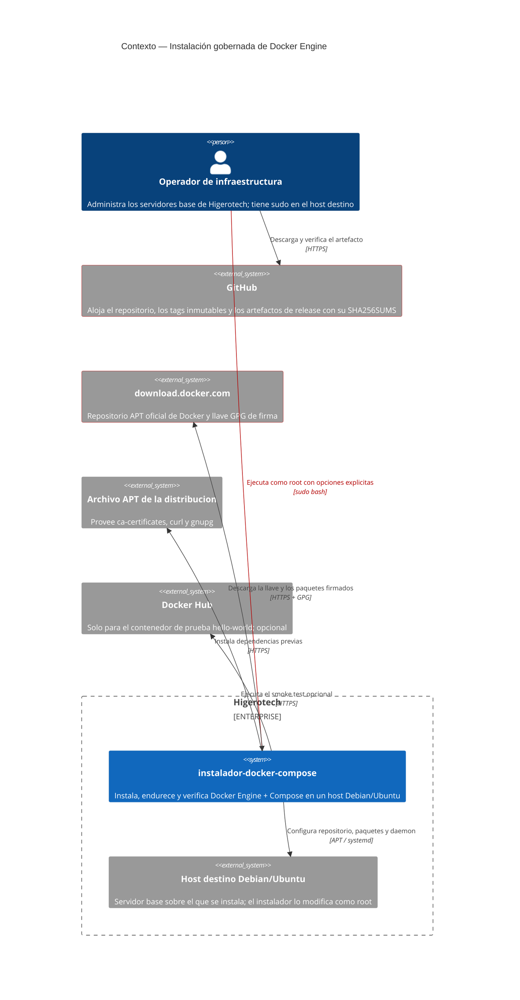
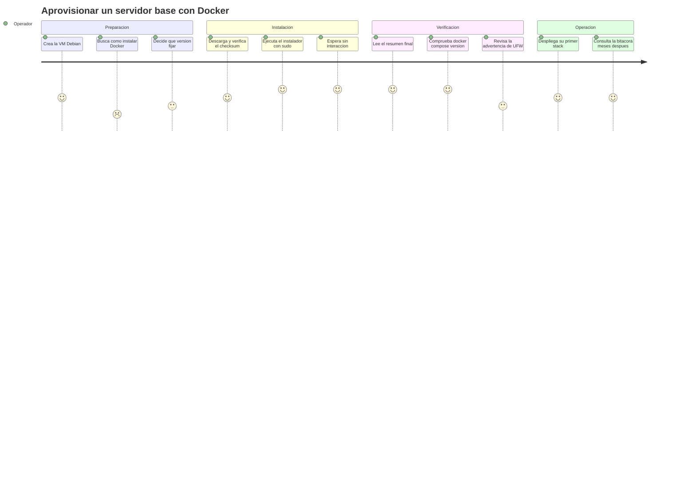
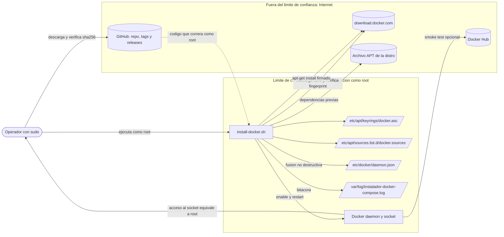
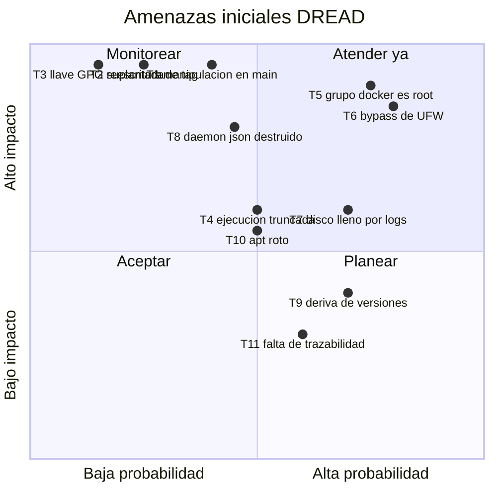

# PRD — Instalación gobernada y endurecida de Docker Engine

* **Estado:** approved
* **Fecha:** 2026-08-30
* **Decisores:** Jeremi Alcala
* **Fase AI-DLC:** 01-requirements
* **Versión:** 0.1.0
* **Gate:** 0
* **Feature/Épica ID:** DOCKER-INSTALL-001
* **Nivel ASVS objetivo:** L2

## Problema y contexto

Higerotech aprovisiona servidores base Debian (y algún Ubuntu) que necesitan Docker Engine y
el plugin Compose. Hoy eso se hace copiando fragmentos de la documentación oficial o
ejecutando `get.docker.com`. El resultado observable:

- **Deriva de versiones**: cada host tiene la versión que era la última el día que se instaló.
- **Sin rotación de logs**: Docker no rota `json-file` por defecto; un contenedor ruidoso
  llena el disco y tumba el host.
- **Grupo `docker` por inercia**: el usuario acaba en el grupo sin que nadie decida que eso
  equivale a concederle root.
- **Cero trazabilidad**: no hay forma de saber qué se instaló, con qué opciones ni cuándo.
- **Cadena de suministro sin verificar**: nadie comprueba que la llave GPG que APT va a
  confiar es realmente la de Docker.

El instalador debe resolver los cinco puntos en un solo comando que se pueda pegar en un
`curl`, sin perder la capacidad de auditarlo antes de ejecutarlo como root.

## Objetivos / No-objetivos

**Objetivos**

1. Una sola invocación deja el host con Docker Engine + Compose operativo y endurecido.
2. La ejecución es segura de repetir: converge, no duplica ni rompe.
3. El operador puede verificar el artefacto **antes** de darle root.
4. Toda instalación deja evidencia en el host.
5. Ningún fallo deja el `apt` del host inutilizable.

**No-objetivos**

- Desplegar aplicaciones ni stacks compose (fuera de alcance — ver charter).
- Sustituir a un gestor de configuración (Ansible, Salt). Este script es el escalón previo:
  lo que se ejecuta en un host recién creado, antes de que exista inventario.
- Endurecer el host completo (SSH, kernel, auditd). Solo el daemon de Docker.

## Contexto del sistema (C4 Context)

*Caption — eje estructura, fase 01-requirements: los dos límites de confianza que importan son
GitHub (de dónde viene el código que corre como root) y download.docker.com (de dónde vienen
los paquetes que APT instalará).*

## Usuarios y escenarios

### Journey del usuario

*Caption — eje trazabilidad, fase 01-requirements: los puntos de dolor son la búsqueda inicial
(puntuación 2) y la decisión sobre firewall (3); el instalador ataca el primero eliminando la
búsqueda y el segundo advirtiendo de forma activa.*

### Escenarios positivos

- **EP1.** Host Debian 12 limpio: una ejecución deja Docker operativo, endurecido y verificado.
- **EP2.** Re-ejecución sobre un host ya instalado: converge la configuración sin reinstalar.
- **EP3.** Flota homogénea: `--docker-version 27.1.1` produce la misma versión en 20 hosts.
- **EP4.** Auditoría previa: el operador descarga, compara el `SHA256SUMS`, lee el script y
  después lo ejecuta.
- **EP5.** Ensayo: `--dry-run` muestra exactamente lo que haría sin tocar el sistema.
- **EP6.** Host con `daemon.json` propio: se añaden solo las claves ausentes y se informa de
  las respetadas.

### Escenarios negativos / abuso (requerido por Gate 0)

| ID | Escenario de abuso | Amenaza |
|---|---|---|
| **EA1** | Un atacante con acceso de escritura al repositorio empuja un commit malicioso a `main`; todo operador que use la URL de `main` lo ejecuta como root en su servidor. | T1 |
| **EA2** | Un atacante con la cuenta del mantenedor comprometida **reescribe un tag existente** para que apunte a código malicioso; las instrucciones publicadas siguen siendo válidas y nadie nota el cambio. | T2 |
| **EA3** | Un atacante en la red (o con una CA comprometida) sirve una llave GPG propia; APT confía en ella e instala paquetes `docker-ce` falsificados con puerta trasera. | T3 |
| **EA4** | Un atacante corta la conexión a mitad de la descarga para que bash ejecute solo el fragmento inicial: el host queda con el repositorio configurado y sin la verificación de la llave. | T4 |
| **EA5** | Un usuario interno sin `sudo` pide entrar al grupo `docker` "para trabajar cómodo"; con ello monta `/` en un contenedor y obtiene root efectivo del host. | T5 |
| **EA6** | El operador publica `-p 0.0.0.0:5432:5432` confiando en que `ufw deny 5432` lo protege; Docker inserta su regla antes que UFW y la base de datos queda expuesta a Internet. | T6 |
| **EA7** | Un contenedor escribe logs de forma masiva (bucle de error, o inducido por un atacante) y llena el disco: el host deja de funcionar por completo. | T7 |
| **EA8** | Se ejecuta el instalador en un host de producción con `daemon.json` personalizado (`data-root` en otro disco, `insecure-registries`); una escritura ciega tumba el daemon y con él todos los contenedores. | T8 |
| **EA9** | Se ejecuta con un `--codename` inexistente; el repositorio no resuelve y **cada `apt-get` posterior del host falla**, incluidas las actualizaciones de seguridad. | T10 |
| **EA10** | En un repositorio privado, el operador incrusta un token en la URL del `curl` y este queda registrado en `~/.bash_history` y en los logs del shell del servidor. | T12 |

## Requisitos funcionales

| ID | Requisito | Prioridad |
|---|---|---|
| **RF01** | Preflight: comprobar root, detectar distribución, codename y arquitectura, y abortar sin tocar el sistema si no es compatible. | Debe |
| **RF02** | Convergencia idempotente: si Docker ya está instalado, revisar y aplicar configuración sin reinstalar. | Debe |
| **RF03** | Instalar desde el repositorio APT oficial de Docker, en formato deb822, con la llave verificada. | Debe |
| **RF04** | Permitir fijar la versión de Docker Engine (`--docker-version`) y fallar con la lista de versiones disponibles si no existe. | Debe |
| **RF05** | Aplicar el perfil de endurecimiento a `daemon.json` por fusión no destructiva, con copia de seguridad previa. | Debe |
| **RF06** | La pertenencia al grupo `docker` es opt-in explícito (`--docker-group`), nunca automática. | Debe |
| **RF07** | Verificar después de instalar: binario, plugin compose, servicio activo, driver de logs; smoke test opcional y no fatal. | Debe |
| **RF08** | Modo `--dry-run` que muestra todas las acciones sin modificar el sistema. | Debe |
| **RF09** | Registrar en `/var/log/instalador-docker-compose.log` la versión del instalador, los argumentos y el resultado. | Debe |
| **RF10** | Ante fallo previo a la instalación, revertir el `docker.sources` y el keyring creados en la ejecución. | Debe |
| **RF11** | Advertir activamente si UFW está activo, por el bypass de puertos publicados. | Debería |
| **RF12** | Soportar distribuciones derivadas mediante `--distro` y `--codename`. | Podría |

## Trazabilidad de requisitos

```mermaid
requirementDiagram
    requirement RF03 {
      id: RF03
      text: Instalar desde el repositorio oficial con llave verificada
      risk: high
      verifymethod: test
    }
    requirement RF05 {
      id: RF05
      text: Endurecer daemon json por fusion no destructiva
      risk: high
      verifymethod: test
    }
    requirement RF10 {
      id: RF10
      text: Revertir el estado de APT ante un fallo previo a instalar
      risk: medium
      verifymethod: test
    }
    requirement RS01 {
      id: RS01
      text: Verificar el fingerprint de la llave GPG antes de confiar en el repositorio
      risk: high
      verifymethod: inspection
    }
    requirement RS03 {
      id: RS03
      text: Una descarga truncada no debe ejecutar una instalacion parcial
      risk: high
      verifymethod: inspection
    }

    element VerificadorGPG {
      type: "componente"
    }
    element AplicadorEndurecimiento {
      type: "componente"
    }
    element RollbackApt {
      type: "componente"
    }
    element EnvoltorioMain {
      type: "componente"
    }
    element PruebaFusion {
      type: "prueba"
    }
    element PruebaMatrizDryRun {
      type: "prueba"
    }
    element PruebaDistroNoSoportada {
      type: "prueba"
    }

    VerificadorGPG - satisfies -> RF03
    VerificadorGPG - satisfies -> RS01
    AplicadorEndurecimiento - satisfies -> RF05
    RollbackApt - satisfies -> RF10
    EnvoltorioMain - satisfies -> RS03
    PruebaFusion - verifies -> RF05
    PruebaMatrizDryRun - verifies -> RF03
    PruebaDistroNoSoportada - verifies -> RF10
```

*Caption — eje trazabilidad, fase 01-requirements: cada requisito de riesgo alto tiene un
componente que lo satisface y una prueba que lo verifica. El círculo se cierra en Gate 3.*

## Requisitos de seguridad (mapeados a OWASP ASVS)

> Nota metodológica: OWASP ASVS está redactado para aplicaciones web. Aquí se usa como la
> taxonomía de control más cercana disponible; el capítulo citado es el análogo conceptual, no
> una correspondencia literal. La trazabilidad real de cada control está en el threat model.

| Req | Requisito de seguridad | ASVS (capítulo análogo) | Nivel | OWASP Top 10:2025 |
|---|---|---|---|---|
| **RS01** | La llave GPG de Docker solo se instala si su fingerprint coincide con el pinneado; si no, se aborta con código 4. | V10 Malicious Code · V14.2 Dependencia | L2 | A03 Supply Chain · A08 Integridad |
| **RS02** | El artefacto se distribuye en tags inmutables con `SHA256SUMS` publicado, verificable antes de ejecutar. | V14.2 Dependencia | L2 | A03 · A08 |
| **RS03** | El script no puede ejecutarse parcialmente: todo el cuerpo vive en funciones y `main "$@"` es la última línea. | V7.4 Manejo de errores | L2 | A10 Condiciones excepcionales |
| **RS04** | Ningún usuario se añade al grupo `docker` sin petición explícita; se advierte de que equivale a root. | V1.4 Arquitectura de control de acceso | L2 | A01 Control de acceso |
| **RS05** | Configuración segura por defecto del daemon: rotación de logs, `live-restore`, `no-new-privileges`, `default-ulimits`. | V14.1 Configuración de build/deploy | L2 | A02 Misconfiguración |
| **RS06** | Toda instalación queda registrada con marca de tiempo, versión y argumentos, con permisos `0640`. | V7.1 · V7.2 Logging | L2 | A09 Logging |
| **RS07** | Un fallo antes de instalar revierte el estado de APT; un `daemon.json` corrupto o no fusionable se conserva intacto. | V7.4 Manejo de errores | L2 | A10 |
| **RS08** | El repositorio no contiene secretos y la URL de descarga no requiere credenciales (repositorio público). | V2.10 Secretos · V14.2 | L2 | A02 · A04 Fallos criptográficos |

## Threat assessment inicial

### Diagrama de flujo de datos (DFD inicial)

*Caption — eje comportamiento, fase 01-requirements: dos cruces de límite concentran el riesgo
— el código que baja de GitHub y se ejecuta como root, y la llave que decide en qué paquetes
confiará APT.*

### Amenazas priorizadas (DREAD inicial)

*Caption — eje trazabilidad, fase 01-requirements: T5 y T6 son las de mayor producto
impacto × probabilidad y las que más a menudo se ignoran, porque son comportamiento normal de
Docker y no un fallo. El análisis STRIDE completo y los controles están en el threat model de
fase 02.*

| ID | Amenaza | Escenario | Score DREAD | Requisito que la mitiga |
|---|---|---|---|---|
| T1 | Manipulación del artefacto en `main` | EA1 | 7.6 | RS02 |
| T2 | Reescritura de tag / cuenta comprometida | EA2 | 6.8 | RS02 |
| T3 | Suplantación de la llave GPG | EA3 | 6.0 | RS01 |
| T4 | Ejecución truncada | EA4 | 6.6 | RS03 |
| T5 | Escalada vía grupo `docker` | EA5 | 8.2 | RS04 |
| T6 | Exposición de puertos por bypass de UFW | EA6 | 8.2 | RF11 |
| T7 | Disco lleno por logs sin rotar | EA7 | 7.2 | RS05 |
| T8 | Destrucción del `daemon.json` existente | EA8 | 6.8 | RS07 |
| T9 | Deriva de versiones en la flota | — | 6.0 | RF04 |
| T10 | APT del host roto por repositorio inválido | EA9 | 6.4 | RS07 / RF10 |
| T11 | Falta de trazabilidad (repudio) | — | 5.2 | RS06 |
| T12 | Token filtrado en el historial del shell | EA10 | — | RS08 (eliminada por diseño: repositorio público) |

## Métricas de éxito

- Instalación limpia en Debian 12/13 y Ubuntu 22.04/24.04 sin intervención: **100%**.
- Ejecuciones que dejan el host con `apt-get update` funcional, incluso al fallar: **100%**.
- Hosts con rotación de logs activa tras instalar: **100%**.
- Usuarios añadidos al grupo `docker` sin `--docker-group` explícito: **0**.
- Cobertura de los requisitos de riesgo alto por una prueba automatizada: **100%**.

## Dependencias y riesgos

**Dependencias externas**

- Disponibilidad y estabilidad de `download.docker.com` (repositorio y llave).
- Que Docker mantenga el fingerprint de firma actual. Si lo rota, el instalador **fallará de
  forma segura** (código 4) hasta que se actualice el pin: es el comportamiento deseado, pero
  exige vigilancia — ver condiciones de revisión en ADR-0003.
- Disponibilidad de GitHub como canal de distribución.
- `python3` en el host para la fusión de `daemon.json` (degradación controlada si falta).

**Riesgos abiertos al cierre de Gate 0**

- `<TODO>` Confirmar en el despliegue real (Gate 2) que la advertencia de UFW es suficiente o
  si conviene ofrecer una regla `DOCKER-USER` opt-in.
- `<TODO>` Definir la política de rotación de la bitácora vía logrotate (propuesta: 90 días).
