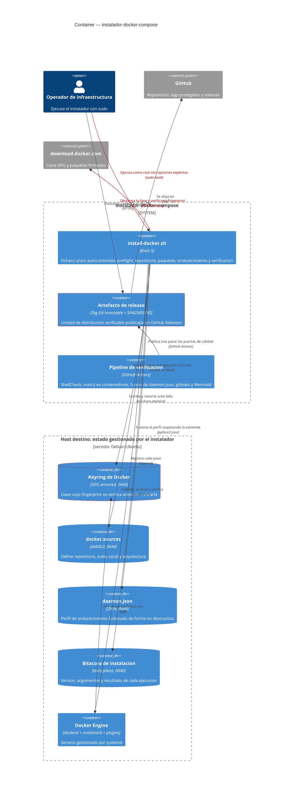
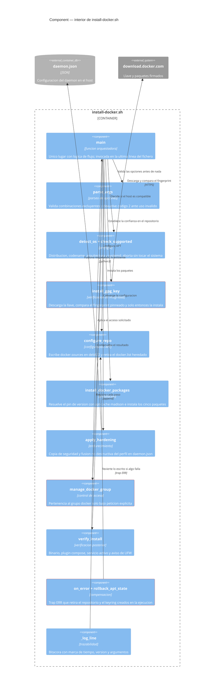
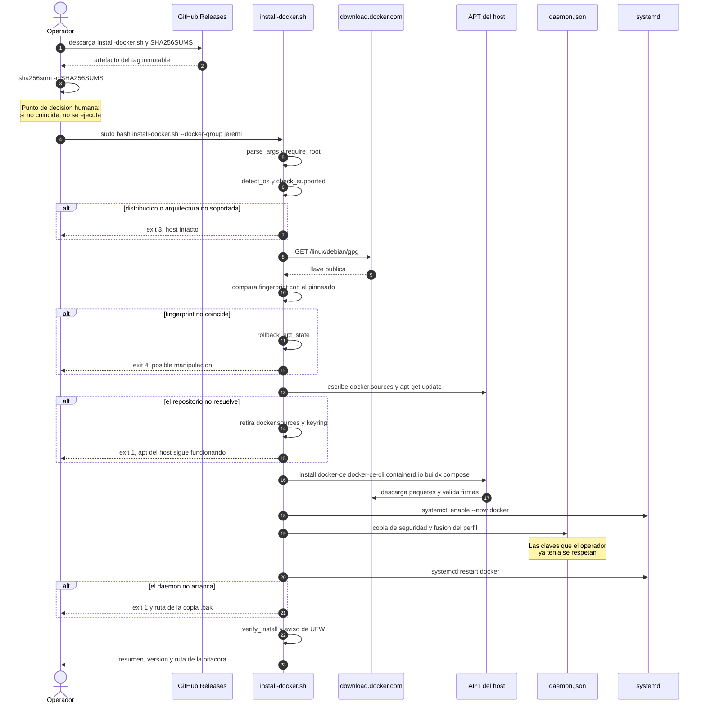
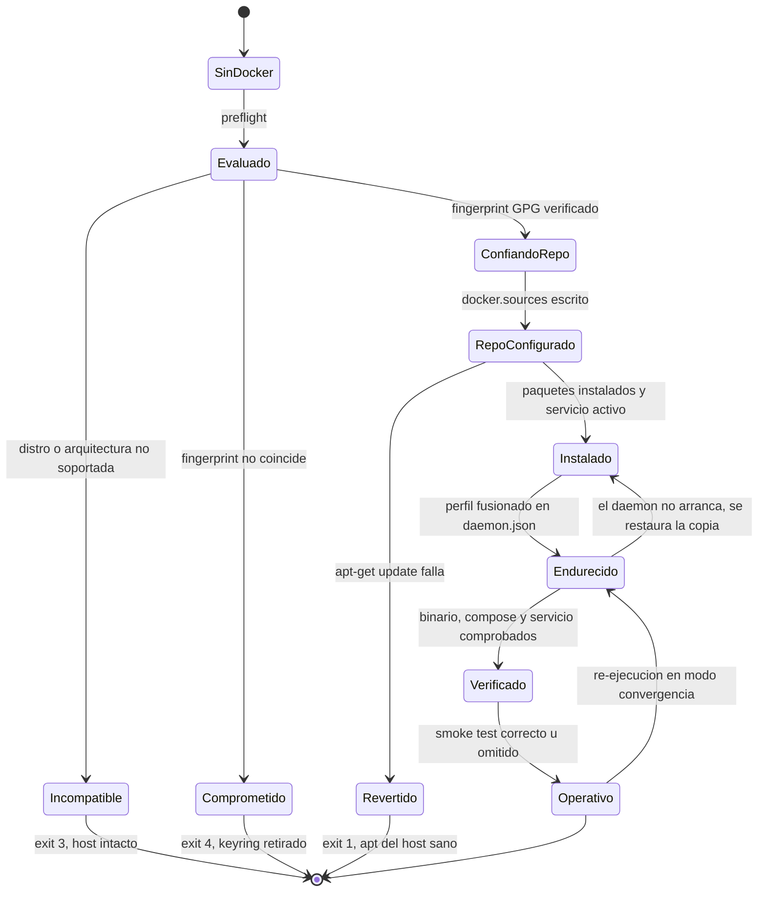
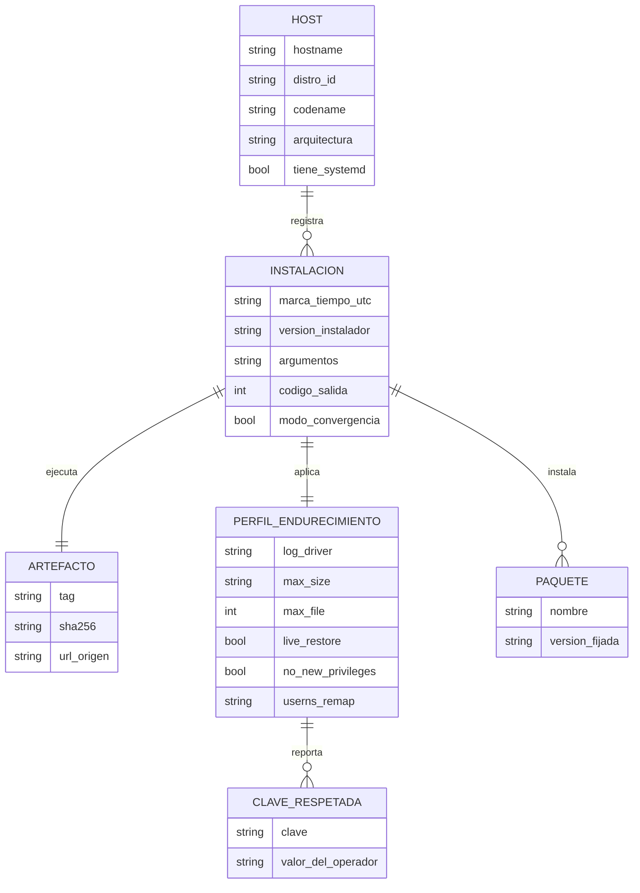
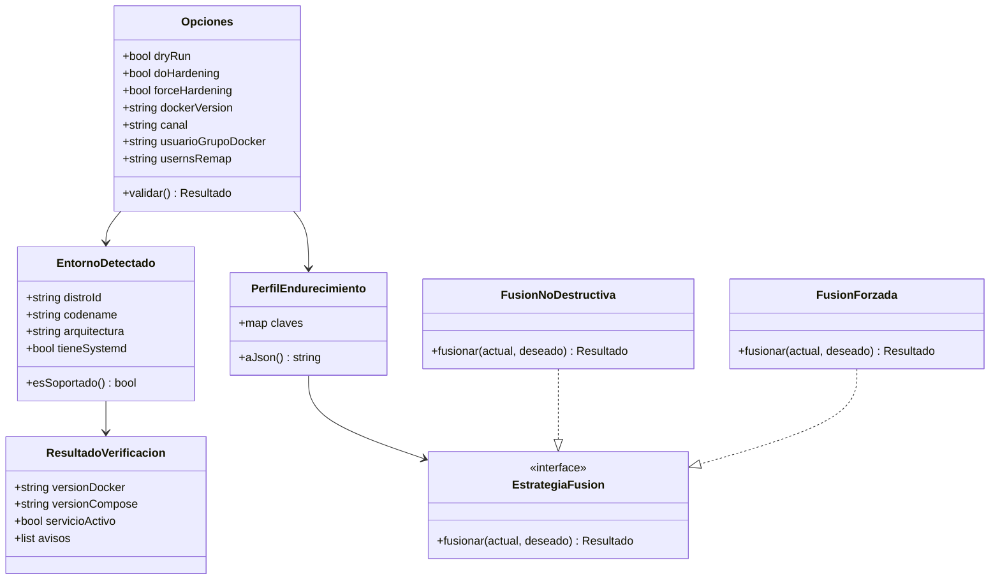

# Diseño del Sistema — instalador-docker-compose

* **Estado:** approved
* **Fecha:** 2026-08-30
* **Decisores:** Jeremi Alcala
* **Fase AI-DLC:** 02-design
* **Versión:** 0.2.0
* **Gate:** 1
* **Estilo arquitectónico:** Script monolítico de un solo fichero, con separación interna por responsabilidad (puertos conceptuales) — ver ADR-0008
* **ADRs relacionadas:** ADR-0001 … ADR-0009

## Decisión estructural de partida

Este sistema tiene una restricción que domina el diseño: **debe poder ejecutarse con
`curl | sudo bash`**. Eso descarta cualquier arquitectura con módulos, librerías o ficheros
auxiliares, porque el intérprete solo recibe un flujo de texto. Todo debe caber en un fichero.

La respuesta no es renunciar a la separación de responsabilidades, sino aplicarla **dentro**
del fichero: cada responsabilidad es una función con una única razón de cambio, el estado
compartido son variables globales explícitas declaradas en un solo bloque, y el flujo de
orquestación vive únicamente en `main`. Es Clean Architecture reducida a lo que Bash permite:
`main` es el caso de uso, las funciones de preflight/repositorio/endurecimiento son los
adaptadores, y el "dominio" son las reglas de qué se considera un host soportado y un daemon
correctamente configurado.

## Contextos acotados (DDD)

| Bounded Context | Responsabilidad | Entidades núcleo |
|---|---|---|
| **Instalación** | Llevar el host desde "sin Docker" hasta "Docker operativo", de forma reversible ante fallo | Host destino, Instalación gobernada, Preflight |
| **Endurecimiento** | Converger `daemon.json` al perfil seguro sin destruir configuración del operador | Perfil de endurecimiento, Clave respetada |
| **Distribución** | Que el artefacto llegue íntegro y verificable al host | Artefacto de release, Tag inmutable, Ancla de integridad |

## Vista C4 — Container

*Caption — eje estructura, fase 02-design: el sistema son tres contenedores (script, artefacto,
pipeline); el cuarto bloque es el estado que el script deja en el host, y es lo que hay que
poder revertir.*

## Vista C4 — Component (interior de install-docker.sh)

*Caption — eje estructura, fase 02-design: los tres componentes marcados en rojo concentran los
controles de seguridad — confianza en el repositorio (RS01), control de acceso (RS04) y
recuperación ante fallo (RS07).*

## Flujos críticos (comportamiento)

*Caption — eje comportamiento, fase 02-design: las cuatro ramas `alt` son el diseño real del
sistema. Un instalador se juzga por lo que hace cuando algo falla, no por el camino feliz.*

## Ciclo de vida del host destino

*Caption — eje comportamiento, fase 02-design: `Operativo → Endurecido` es la arista que hace
que el script sea convergente y no solo idempotente; una re-ejecución sirve para algo.*

## Modelo de datos y dominio

*Caption — eje estructura, fase 02-design: el modelo describe lo que una instalación deja
registrado. `CLAVE_RESPETADA` existe porque el sistema debe poder explicar qué **no** cambió.*

*Caption — eje estructura, fase 02-design: la única abstracción con dos implementaciones reales
es la estrategia de fusión, que es exactamente donde `--force-hardening` cambia el
comportamiento. En Bash esto son dos ramas de `apply_hardening`, pero el contrato es este.*

## Contratos

El contrato de este sistema no es HTTP: es una **interfaz de línea de comandos** más el
conjunto de ficheros que escribe y los códigos de salida que devuelve. Está especificado
íntegramente en [`interfaces-contract.md`](interfaces-contract.md), que es el artefacto que
cierra el requisito de "contratos de API" del Gate 1.

Resumen de la superficie estable:

| Superficie | Elemento | Estabilidad |
|---|---|---|
| Entrada | 14 opciones de línea de comandos | SemVer: quitar o cambiar el significado de una opción es cambio MAYOR |
| Salida | Códigos 0–5 | Estable; añadir un código nuevo es cambio MENOR |
| Efecto | 4 rutas de fichero escritas | Estable; cambiar una ruta es cambio MAYOR |
| Entorno | `DEBIAN_FRONTEND`, `NEEDRESTART_MODE` fijados internamente | Detalle de implementación |

## Patrones de seguridad seleccionados (por amenaza DREAD priorizada)

| Amenaza | Patrón / Control | Implementación | OWASP |
|---|---|---|---|
| T5 (8.2) escalada vía grupo docker | Deny by default + consentimiento explícito | `--docker-group` obligatorio; advertencia en cada ejecución | A01 |
| T6 (8.2) bypass de UFW | Detección y aviso activo (no modificación silenciosa) | `firewall_advisory` consulta `ufw status` | A02 |
| T1 (7.6) manipulación en `main` | Artefacto inmutable + ancla de integridad | Tag SemVer + `SHA256SUMS` en la release | A03 / A08 |
| T7 (7.2) disco lleno por logs | Configuración segura por defecto | `log-opts max-size 10m, max-file 3` | A02 |
| T2 (6.8) reescritura de tag | Protección de rama y tags + verificación previa | Reglas del repositorio + procedimiento del runbook | A08 |
| T8 (6.8) destrucción de `daemon.json` | Backup + fusión no destructiva + restauración | `apply_hardening` con copia `.bak` y `python3` | A10 |
| T4 (6.6) ejecución truncada | Envoltura total en funciones | `main "$@"` como última línea | A10 |
| T10 (6.4) APT roto | Compensación transaccional | `trap ERR` → `rollback_apt_state` | A10 |
| T3 (6.0) llave suplantada | Pinning de fingerprint | Comparación contra `DOCKER_GPG_FPR`, exit 4 | A03 / A08 |
| T9 (6.0) deriva de versiones | Pin reproducible | `--docker-version` + `apt-cache madison` | A03 |
| T11 (5.2) repudio | Registro de auditoría | Bitácora `0640` con versión y argumentos | A09 |
