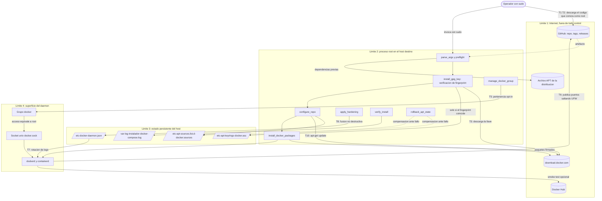
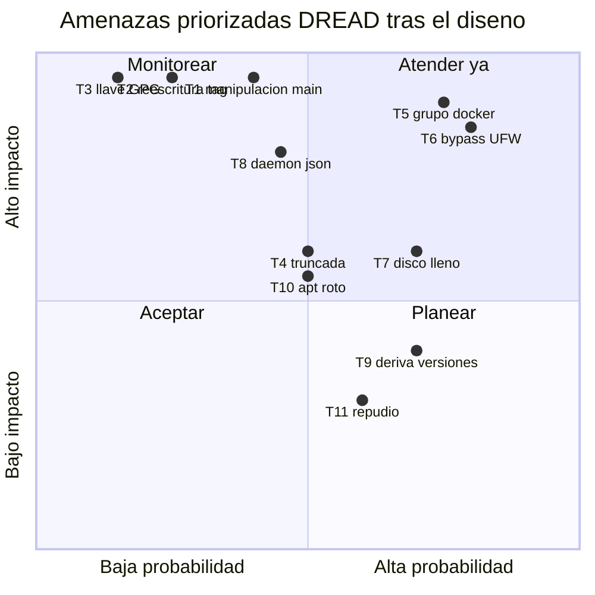

# Threat Model — instalador-docker-compose

* **Estado:** approved
* **Fecha:** 2026-08-30
* **Decisores:** Jeremi Alcala
* **Fase AI-DLC:** 02-design
* **Versión:** 0.2.0
* **Gate:** 1
* **Alcance:** El instalador, su canal de distribución y el estado que deja en el host destino. **Fuera de alcance:** la seguridad de las cargas que después se ejecuten sobre ese Docker.
* **Metodología:** STRIDE + DREAD
* **Clasificación de datos (ref):** `docs/00-project/data-classification.md`

## Premisa del modelo

Este sistema tiene una característica que condiciona todo el análisis: **el activo que se
protege no son datos, es la ejecución como root**. No hay base de datos que exfiltrar ni
sesiones que secuestrar. Lo que hay es un canal por el que baja código que un operador va a
ejecutar con privilegios totales sobre un servidor, y una decisión sobre en qué llave GPG
confiará el gestor de paquetes de ese servidor a partir de ese momento.

Por eso el peso del modelo cae en **Tampering** e **Integridad de la cadena de suministro**
(A03, A08), y no en confidencialidad.

## Diagrama de flujo de datos (DFD con límites de confianza)

*Caption — eje comportamiento, fase 02-design: cuatro límites de confianza. El cruce TB1→TB2
(código que se ejecuta como root) y TB2→TB3 (qué llave se persiste) son los que concentran las
amenazas de mayor impacto.*

## Análisis STRIDE

| Componente | Spoofing | Tampering | Repudiation | Info Disclosure | DoS | Elevation |
|---|---|---|---|---|---|---|
| **Canal GitHub (TB1)** | Cuenta del mantenedor suplantada (**T2**) | Commit malicioso en `main` (**T1**); reescritura de tag (**T2**) | Sin registro de quién publicó qué release | Repositorio público por diseño: no hay nada que revelar | Indisponibilidad de GitHub bloquea el aprovisionamiento | Ejecución de código arbitrario como root en cada host que instale |
| **download.docker.com (TB1)** | Llave GPG suplantada por MITM o CA comprometida (**T3**) | Paquetes falsificados aceptados por APT si la llave es falsa (**T3**) | — | — | Repositorio caído impide instalar | Puerta trasera en `docker-ce` ejecutándose como root |
| **install-docker.sh (TB2)** | — | Descarga truncada ejecuta un fragmento (**T4**) | Sin bitácora no hay traza de qué se instaló (**T11**) | La salida podría revelar rutas internas en un ticket | Bucle o cuelgue durante `apt-get` | El script ya corre como root: cualquier defecto es escalada directa |
| **Keyring `docker.asc` (TB3)** | Llave que no es de Docker aceptada como tal (**T3**) | Sustitución posterior de la llave por otro proceso root | — | Llave pública: sin impacto | — | APT confiaría en un firmante arbitrario |
| **`docker.sources` (TB3)** | Repositorio apuntando a un espejo hostil | Codename inválido rompe todo `apt-get` del host (**T10**) | — | Revela distribución y arquitectura | **Bloquea las actualizaciones de seguridad del host** (**T10**) | Instalación de paquetes de un origen no legítimo |
| **`daemon.json` (TB3)** | — | Sobrescritura de la configuración del operador (**T8**) | — | Expone `data-root` e `insecure-registries` | `daemon.json` inválido impide arrancar el daemon (**T8**) | Configuración laxa habilita contenedores privilegiados |
| **Bitácora (TB3)** | — | Borrado de la traza por un atacante con root | Es precisamente el control anti-repudio (**T11**) | Revela usuarios con acceso al daemon y versiones | Crecimiento sin rotación | — |
| **Socket y grupo docker (TB4)** | — | — | Acciones vía socket atribuidas al daemon, no al usuario | Lectura de cualquier fichero montando volúmenes | Agotamiento de recursos del host | **Miembro del grupo obtiene root montando `/`** (**T5**) |
| **Docker Engine (TB4)** | — | — | — | Logs sin rotar exponen contenido a quien lea el disco | Disco lleno por logs (**T7**); descriptores agotados | Puertos publicados ignoran UFW (**T6**) |

## Amenazas priorizadas (DREAD)

*Caption — eje trazabilidad, fase 02-design: T5 y T6 caen en "atender ya" no por ser exóticas
sino por lo contrario — son el comportamiento documentado de Docker, ocurren siempre, y por eso
se pasan por alto.*

| ID | Amenaza | D | R | E | A | D | Score | Control / ADR |
|---|---|---|---|---|---|---|---|---|
| **T5** | Pertenencia al grupo `docker` concede root de facto | 9 | 9 | 8 | 6 | 9 | **8.2** | Opt-in explícito `--docker-group` + advertencia en cada ejecución — **ADR-0007** |
| **T6** | Puertos publicados por Docker ignoran UFW | 8 | 9 | 7 | 8 | 9 | **8.2** | `firewall_advisory` detecta UFW activo y avisa; receta `DOCKER-USER` en el runbook — **RF11** |
| **T1** | Commit malicioso en `main` ejecutado como root | 9 | 8 | 6 | 7 | 8 | **7.6** | URL canónica = tag inmutable; `SHA256SUMS` publicado; `main` documentado solo para pruebas — **ADR-0002** |
| **T7** | Disco lleno por logs de contenedor sin rotar | 6 | 8 | 6 | 7 | 9 | **7.2** | `log-opts max-size 10m / max-file 3` por defecto — **ADR-0005** |
| **T2** | Reescritura de un tag existente | 10 | 7 | 4 | 6 | 7 | **6.8** | Protección de tags y rama en GitHub + verificación de checksum por el operador — **ADR-0002** |
| **T8** | Destrucción del `daemon.json` de un host en producción | 8 | 7 | 5 | 6 | 8 | **6.8** | Copia `.bak` + fusión no destructiva + restauración ante JSON inválido — **ADR-0005** |
| **T4** | Ejecución truncada de la descarga | 6 | 7 | 7 | 5 | 8 | **6.6** | Cuerpo íntegro en funciones; `main "$@"` en la última línea — **ADR-0008** |
| **T10** | `apt` del host roto por repositorio inválido | 6 | 6 | 6 | 6 | 8 | **6.4** | `trap ERR` → `rollback_apt_state`; validación de codename con aviso — **ADR-0008** |
| **T3** | Llave GPG suplantada | 10 | 5 | 3 | 6 | 6 | **6.0** | Pin del fingerprint `9DC8…CD88`, salida con código 4 — **ADR-0003** |
| **T9** | Deriva de versiones en la flota | 4 | 7 | 5 | 6 | 8 | **6.0** | `--docker-version` resuelto con `apt-cache madison` — **ADR-0004** |
| **T11** | Repudio: sin traza de qué se instaló | 3 | 6 | 5 | 5 | 7 | **5.2** | Bitácora `0640` con versión, argumentos y resultado — **RS06** |
| **T12** | Token en la URL filtrado al historial del shell | — | — | — | — | — | **Eliminada** | Repositorio público: el `curl` no lleva credenciales — **ADR-0002** |

## Controles y trazabilidad

Toda amenaza con score ≥ 6.0 tiene un control implementado y verificado por una prueba
automatizada. Ninguna queda solo documentada.

| Amenaza | Control | Dónde vive | Prueba que lo verifica |
|---|---|---|---|
| T5 | Grupo `docker` opt-in | `manage_docker_group` | `dry-run-matrix.sh`: "el grupo docker es opt-in explícito" |
| T6 | Aviso de bypass de UFW | `firewall_advisory` | `install-real.sh` (prueba 4): con UFW activo avisa y ofrece la mitigación; sin UFW no avisa |
| T1 / T2 | Tag inmutable + checksum | `release.yml`, README | `release.yml`: el tag debe coincidir con `SCRIPT_VERSION` |
| T7 | Rotación de logs por defecto | `print_hardening_profile` | `hardening-merge.sh`: "aplica la rotación de logs" |
| T8 | Fusión no destructiva + backup | `apply_hardening` | `hardening-merge.sh`: 6 aserciones, incluida la de JSON corrupto |
| T4 | `main "$@"` al final | Estructura del fichero | Revisión en PR + `bash -n`; ShellCheck en CI |
| T10 | Rollback del estado APT | `on_error`, `rollback_apt_state` | `gpg-integrity.sh` (prueba 2): tras un fallo real se retiran repositorio y keyring y `apt-get update` del host sigue funcionando. **Este control estuvo roto hasta 1.0.1** — ver nota abajo |
| T3 | Pin de fingerprint | `install_gpg_key` | **Verificado en los dos sentidos**: acepta la llave legítima (host real, 2026-08-30) y **rechaza** una llave de atacante con código 4 (`gpg-integrity.sh`, prueba 1, con origen HTTPS suplantado) |
| T9 | Pin de versión | `resolve_version_string` | `install-real.sh` (prueba 1): una versión inexistente no se instala y se listan las disponibles |
| T11 | Bitácora | `_log_line` | `install-real.sh`: START con formato del contrato, fingerprint verificado, argumentos y END |

### Nota de corrección: T10 estuvo mitigado solo sobre el papel (hasta 1.0.1)

Este documento afirmó desde el Gate 1 que T10 estaba mitigado por el `trap ERR` →
`rollback_apt_state`. **La afirmación era falsa en la práctica**, y conviene que quede escrito.

El script declaraba `set -euo pipefail` sin la `E`. Bash **no hereda la trampa `ERR` dentro de
funciones** salvo con `-E` (`errtrace`), y como todo el cuerpo vive en funciones por diseño
(ADR-0008), `on_error` jamás se ejecutaba. Ante un fallo el script salía por `errexit` sin
revertir nada, dejando el `docker.sources` inválido que T10 describe.

Por qué no se detectó antes: **el camino de fallo nunca se había ejercido**. Todas las pruebas
anteriores recorrían el camino feliz o abortaban en el preflight (códigos 2 y 3), que salen con
`exit` y no pasan por la trampa. Hizo falta una prueba que provocara un fallo *después* de
escribir en el host —la prueba 2 de `gpg-integrity.sh`— para que el defecto apareciera.

Lección para el resto del modelo: **un control cuya ruta no se ejercita no es un control, es una
intención**. Los controles que hoy siguen sin ruta de fallo probada quedan listados como brechas
en `docs/04-testing/test-strategy.md`, no marcados como mitigados.

### Riesgos aceptados de forma explícita

1. **El operador puede saltarse la verificación de integridad.** Nada impide un
   `curl .../main/install-docker.sh | sudo bash`. Se mitiga con documentación, no con técnica:
   el README pone primero la forma verificada. Aceptado — imponer la verificación rompería el
   caso de uso que motiva el proyecto.

2. **El fingerprint pinneado caducará.** Si Docker rota su llave, el instalador fallará con
   código 4 en toda la flota hasta que se publique una versión nueva. Es un fallo *seguro*,
   pero es una dependencia operativa real. Condiciones de revisión en ADR-0003.

3. **No se firma el artefacto con GPG ni Sigstore.** El ancla es el `SHA256SUMS` de la release,
   que protege contra manipulación en tránsito pero no contra una cuenta de GitHub
   comprometida. Diferido: ver ADR-0002, condiciones de revisión.

4. **`live-restore` es incompatible con Swarm.** Si algún host adopta Swarm, el perfil deberá
   ajustarse. Aceptado porque Swarm está fuera del alcance declarado.
