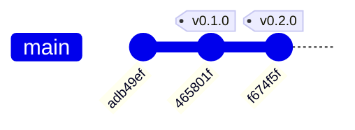

# Historial de implementación — instalador-docker-compose

* **Estado:** review
* **Fecha:** 2026-08-30
* **Decisores:** Jeremi Alcala
* **Fase AI-DLC:** 03-implementation
* **Versión:** 0.2.0
* **Gate:** 2
* **Rama principal:** main
* **Estrategia de branching:** trunk-based con tags SemVer

## Documentación viva: este archivo se genera, no se escribe

El `gitGraph` de esta fase **no se redacta a mano**: se deriva del historial real del
repositorio. Escribirlo a mano garantiza que se desincronice del árbol de commits en la primera
semana, y un diagrama de trazabilidad que miente es peor que no tenerlo.

Regenera tras cada merge o tag, y vuelve a anteponer esta cabecera y las secciones de
trazabilidad e invariantes:

```bash
python scripts/gitgraph_from_log.py . --branch main \
  --out docs/03-implementation/repo-history.md
```

## Historial del repositorio (documentación viva)

Derivado de `git log` con `scripts/gitgraph_from_log.py`. Los tags SemVer enlazan con las
versiones del `CHANGELOG.md`.

### Grafo de commits y merges



*Caption — eje trazabilidad, fase 03-implementation: historia lineal trunk-based. Cada tag
corresponde al cierre de un gate, no a una entrega funcional: `v0.1.0` es documentación de
requisitos y `v0.2.0` es el primer artefacto ejecutable.*

### Bitácora de cambios (fiel al repo)

| Commit | Tipo | Tags | Autor | Fecha | Mensaje |
|---|---|---|---|---|---|
| `f674f5f` | commit | v0.2.0 | Jeremi Alcala | 2026-08-30 | feat: instalador endurecido y cierre del Gate 1 — diseño, threat model y ADRs |
| `465801f` | commit | v0.1.0 | Jeremi Alcala | 2026-08-30 | docs: cierre del Gate 0 — requisitos, alcance y threat assessment inicial |
| `adb49ef` | commit | — | Jeremi J. Alcalá M. | 2026-08-30 | Initial commit |

## Notas sobre la construcción de esta historia

Tres decisiones sobre el historial que conviene dejar registradas, porque no son evidentes
mirando el grafo:

1. **Dos commits en lugar de uno.** Aunque todo el contenido se produjo en una sola sesión, se
   separó en dos commits para que cada tag contenga exactamente lo que cerró su gate. `v0.1.0`
   no contiene `install-docker.sh` ni `.github/`: es documentación de requisitos y nada más.

2. **`v0.1.0` no dispara el workflow de release, y es correcto.** Los workflows se ejecutan
   desde el ref que los dispara, y en `v0.1.0` no existe `.github/`. Si existiera,
   `release.yml` fallaría al no encontrar el instalador para comprobar `SCRIPT_VERSION`. Un tag
   de hito documental no publica artefacto.

3. **La raíz `adb49ef` viene del remoto.** El repositorio de GitHub se creó con un `LICENSE`
   (GPL-3.0). La historia local se rebasó sobre ese commit en vez de forzar el push, de modo
   que la licencia se conserva como raíz y el push es fast-forward. Los tags se recrearon
   sobre los commits rebasados.

> **Estado de publicación:** los commits y tags existen **solo en local**. `origin/main` sigue
> en `adb49ef` hasta que se ejecute `git push -u origin main --follow-tags`. Antes de empujar
> conviene activar la protección de rama y de tags (criterio de Gate 4), porque sin ella la
> inmutabilidad de los tags que sostiene ADR-0002 no es real.

## Trazabilidad tag ↔ versión ↔ decisión

| Tag | Commit | Versión CHANGELOG | Gate | ADR / artefacto que lo motiva |
|---|---|---|---|---|
| `v0.1.0` | `465801f` | 0.1.0 | Gate 0 — Requirements | Charter, glosario, clasificación de datos, PRD DOCKER-INSTALL-001 |
| `v0.2.0` | `f674f5f` | 0.2.0 | Gate 1 — Design | ADR-0001 … ADR-0009, threat model STRIDE/DREAD, contrato CLI, `install-docker.sh` 0.2.0 |
| `v1.0.0` | *(al mergear)* | 1.0.0 | Gate 2 — Build | Verificación en host real Ubuntu 24.04; contrato CLI congelado. Sustituye al `v0.3.0` que preveía la convención — ver la entrada de `1.0.0` en el `CHANGELOG.md` |
| `v1.1.0` | *(pendiente)* | *(pendiente)* | Gate 3 — Testing | Prueba negativa del fingerprint GPG y cierre de las brechas de `test-strategy.md` |
| `v1.2.0` | *(pendiente)* | *(pendiente)* | Gate 4 — Deployment | CI como check obligatorio y primera release publicada por el workflow |
| `v1.3.0` | *(pendiente)* | *(pendiente)* | Gate 5 — Monitoring | Inventario de flota y proceso de incidentes ensayado |

## Invariantes de implementación que la revisión de PR debe proteger

Estas tres propiedades son controles de seguridad que viven en la *estructura* del código, no
en una línea concreta. Un refactor descuidado las elimina sin que ninguna prueba falle:

1. **`main "$@"` es la última línea del fichero y la única sentencia ejecutable de nivel
   superior.** Añadir cualquier comando fuera de una función rompe la mitigación de T4
   (ADR-0008).
2. **`$SUDO_USER` no se usa para conceder acceso al grupo `docker`.** Es una omisión
   deliberada, no un olvido (ADR-0007).
3. **`rollback_apt_state` solo retira lo que la ejecución actual creó**, según las banderas
   `SOURCES_CREATED` y `KEYRING_CREATED`. Retirar incondicionalmente destruiría configuración
   legítima al re-ejecutar (ADR-0008).
4. **La `E` de `set -eEuo pipefail` es funcional, no estilística.** Sin ella bash no hereda la
   trampa `ERR` dentro de funciones y `on_error` no se ejecuta nunca, con lo que el rollback del
   punto 3 queda desactivado en silencio. Fue un defecto real hasta 1.0.1; quitarla no rompe
   ninguna prueba de camino feliz, solo `tests/gpg-integrity.sh`.
