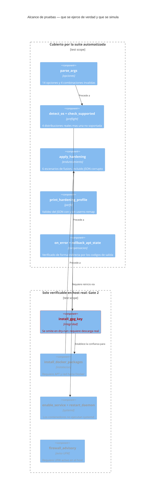
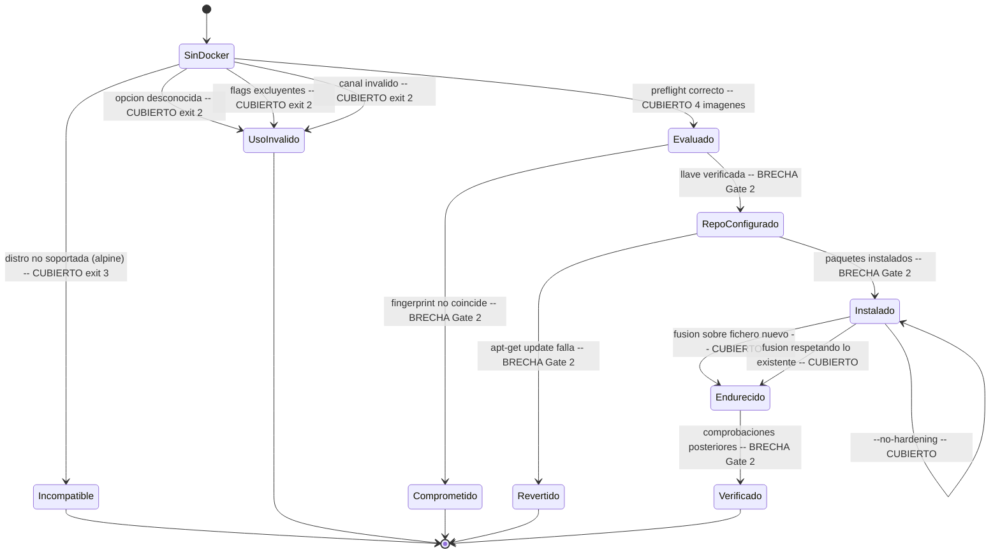

# Estrategia de pruebas

* **Estado:** review
* **Fecha:** 2026-08-30
* **Decisores:** Jeremi Alcala
* **Fase AI-DLC:** 04-testing
* **Versión:** 0.2.0
* **Gate:** 3
* **Alcance de la suite:** `install-docker.sh` y sus efectos en el host
* **Ejecución local:** `bash tests/run-all.sh`

## La pirámide, adaptada a un instalador

La pirámide clásica no encaja tal cual: aquí no hay clases que instanciar ni servicios que
levantar. Lo que sí hay es un gradiente equivalente, del más barato y rápido al más caro y
lento:

| Nivel | Qué prueba | Herramienta | Dónde corre | Coste |
|---|---|---|---|---|
| **Estático** | Sintaxis, quoting, expansiones inseguras | `bash -n`, ShellCheck | CI + local | Segundos |
| **Unitario** | Funciones aisladas con salida determinista | `tests/hardening-merge.sh` | Contenedor `python:3.12-slim` | Segundos |
| **Integración** | El script completo contra un SO real | `tests/dry-run-matrix.sh` | Contenedores Debian/Ubuntu | ~1 min |
| **Contrato** | Códigos de salida y ficheros escritos | Aserciones en la matriz + `release.yml` | CI | Segundos |
| **Seguridad** | Secretos, y que los controles **rechacen** lo que deben rechazar | gitleaks, `tests/gpg-integrity.sh` | Contenedor `debian:12` | ~2 min |
| **Sistema (E2E)** | Instalación real de paquetes, convergencia, bitácora | `tests/install-real.sh` | Contenedor `debian:12` | ~4 min |
| **Sistema con systemd** | `enable`, `restart`, `is-active`, smoke test | Manual en VM | Gate 2 | Minutos, requiere VM |

La base es ancha y automatizada; la cúspide es manual **por una razón estructural, no por
pereza**: verificar la instalación real exige systemd, red hacia `download.docker.com` y un
host desechable. Los contenedores no ejecutan systemd, así que hay un techo que la
automatización actual no atraviesa. Está declarado abajo como brecha conocida.

## Alcance de las pruebas sobre la arquitectura

*Caption — eje estructura, fase 04-testing: el límite entre lo que la suite ejerce de verdad y
lo que queda para el Gate 2. `install_gpg_key` se marca en rojo porque es el control de
seguridad más importante que **no** está cubierto automáticamente.*

## Pruebas de transición de estado

Las transiciones inválidas son las que cubren los escenarios de abuso: un instalador se rompe
en los caminos que nadie prueba.

*Caption — eje comportamiento, fase 04-testing: las transiciones marcadas BRECHA son las que
requieren un host real. Todas las que se pueden automatizar hoy, lo están.*

## Trazabilidad requisito ↔ prueba

Cierra el círculo abierto en el `requirementDiagram` del PRD (Gate 0).

*Caption — eje trazabilidad, fase 04-testing: cuatro de los cinco requisitos de riesgo alto
tienen prueba automatizada; RS01 queda con verificación por demostración en Gate 2.*

## Matriz OWASP Top 10:2025 × cobertura

| Riesgo | Aplica | Cómo se prueba | Estado |
|---|---|---|---|
| **A01** Broken Access Control | Sí (T5) | `dry-run-matrix.sh`: nadie entra al grupo sin `--docker-group` | ✅ Automatizado |
| **A02** Security Misconfiguration | Sí (T6, T7) | `hardening-merge.sh` (rotación) + `install-real.sh` (perfil aplicado en instalación real y aviso de UFW) | ✅ Automatizado |
| **A03** Software Supply Chain | Sí (T1, T2, T3, T9) | `gpg-integrity.sh` (rechazo de llave falsa) + `install-real.sh` (pin) + `release.yml` (tag ↔ versión ↔ changelog) | ✅ Automatizado |
| **A04** Cryptographic Failures | Marginal | `curl --proto '=https' --tlsv1.2` en la descarga de la llave | ✅ Por construcción |
| **A05** Injection | Marginal | ShellCheck detecta expansiones sin comillas; sin entrada no confiable interpretada | ✅ Estático |
| **A06** Insecure Design | Sí | Threat model + ADRs revisadas en Gate 1 | ✅ Revisión |
| **A07** Identification/AuthN | No aplica | El instalador no autentica; delega en `sudo` | — |
| **A08** Data Integrity | Sí (T1, T2, T4) | `SHA256SUMS` en release (verificado end-to-end en `v1.0.0`); `main "$@"` revisado en PR | ⚠️ Parcial |
| **A09** Logging Failures | Sí (T11) | `install-real.sh`: START con formato, fingerprint, argumentos y END | ✅ Automatizado |
| **A10** Exceptional Conditions | Sí (T4, T8, T10) | Códigos 2/3/4 verificados; JSON corrupto verificado | ✅ Automatizado |

## Estado actual de la suite

Ejecución del 2026-08-30 en Docker 29.5.2. **108 aserciones automatizadas.**

| Suite | Nivel | Aserciones | Resultado |
|---|---|---|---|
| ShellCheck (instalador + 5 scripts de test), fijado a `v0.11.0` | Estático | — | Sin hallazgos |
| `hardening-merge.sh` — fusión de `daemon.json` | Unitario | 14 | 14 pass |
| `dry-run-matrix.sh` — 4 distribuciones + no soportada | Integración | 41 | 41 pass |
| `gpg-integrity.sh` — origen suplantado, rechazo y rollback | Seguridad | 15 | 15 pass |
| `install-real.sh` — instalación real, convergencia, bitácora, pin, UFW | Sistema | 38 | 38 pass |
| Validación Mermaid de `docs/` | Estático | 1 por diagrama | Todos válidos |

### Lo que aportó cada nivel

Merece la pena registrar **qué encontró cada tipo de prueba**, porque justifica el coste de las
lentas:

- El nivel estático y el unitario no encontraron defectos: confirmaron lo que ya funcionaba.
- El nivel de integración (`--dry-run`) tampoco: recorre el camino feliz y las salidas tempranas.
- **El nivel de seguridad encontró el único defecto real del proyecto**: el rollback de T10 no
  funcionaba porque la trampa `ERR` no se heredaba dentro de funciones. Hizo falta una prueba
  que provocara un fallo *después* de escribir en el host; ninguna prueba anterior lo hacía.

La conclusión operativa es que las pruebas del camino feliz dan una falsa sensación de
cobertura sobre los controles de recuperación. Un control cuya ruta de fallo no se ejercita no
está verificado, por muchas aserciones verdes que haya alrededor.

## Brechas conocidas y cómo se cierran

Se declaran de forma explícita porque un gate no se cierra ocultando lo que falta.

| Brecha | Impacto | Cómo se cierra | Gate |
|---|---|---|---|
| **systemd no se ejercita** en la suite: `enable`, `restart`, `is-active` | Los contenedores no ejecutan systemd. Verificado a mano en el host real del Gate 2, pero no hay regresión automatizada | VM efímera en CI, o imagen con systemd | 3 |
| La instalación real solo se prueba en **Debian 12** | Debian 13 y Ubuntu 22.04/24.04 solo pasan por `--dry-run`; 24.04 se verificó a mano | Extender `install-real.sh` a una matriz de imágenes | 3 |
| `--userns-remap` solo validado como JSON | Marcado experimental en el contrato de interfaces | Prueba en VM con daemon real antes de promoverlo a estable | 3 |
| El **smoke test** (`docker run hello-world`) no se ejercita | Requiere daemon en marcha; se omite con `--skip-smoke` en toda la suite | VM efímera, junto con systemd | 3 |
| Rutas de fallo de `apply_hardening` con daemon real | Un `daemon.json` válido pero que impida arrancar al daemon debería restaurarse; hoy solo se prueba el JSON corrupto | VM con daemon real | 3 |

### Brechas cerradas en 1.0.1

| Brecha | Cómo se cerró |
|---|---|
| Prueba **negativa** del fingerprint GPG (RS01/T3) | `gpg-integrity.sh`: origen HTTPS con CA propia que suplanta `download.docker.com` y sirve una llave de atacante bien formada |
| Rollback del estado de APT (T10) | `gpg-integrity.sh` prueba 2 — **encontró que el control estaba roto** |
| Instalación real de paquetes | `install-real.sh` prueba 2, desde el repositorio oficial |
| Aserción automatizada sobre la bitácora (A09/T11) | `install-real.sh`: START con formato del contrato, fingerprint, argumentos y END |
| `--docker-version` (pin, T9) | `install-real.sh` prueba 1 |
| Aviso de UFW (T6) | `install-real.sh` prueba 4, con doble de prueba de `ufw` |
| Convergencia en segunda ejecución | `install-real.sh` pruebas 3a y 3b |
| Ruta degradada sin `python3` | `install-real.sh` prueba 3a — no estaba ni declarada como brecha |

## Criterios de Gate 3

- [x] **Prueba negativa de integridad**: una llave GPG que no coincide produce código 4 y deja
      el host intacto — `gpg-integrity.sh`, con origen HTTPS suplantado.
- [x] **Ruta de fallo con rollback ejercida**: tras un fallo posterior a escribir en el host, el
      repositorio y el keyring se retiran y `apt-get update` sigue funcionando. Encontró que el
      control estaba roto (corregido en 1.0.1).
- [x] Instalación real de paquetes verificada (Debian 12 en la suite; Ubuntu 24.04 en host real).
- [x] Prueba de convergencia: la segunda ejecución no reinstala y respeta la configuración
      existente, con y sin `python3`.
- [x] Prueba de pin de versión: una versión inexistente no se instala y se listan las disponibles.
- [x] Aserción automatizada sobre la bitácora (A09/T11).
- [x] Aviso del bypass de UFW verificado (T6).
- [x] Toda amenaza con score DREAD ≥ 6.0 tiene al menos una prueba automatizada que ejerce su
      control (10 de 10).
- [ ] Instalación real en la **matriz completa** (Debian 13, Ubuntu 22.04/24.04), no solo Debian 12.
- [ ] systemd y smoke test ejercitados en una VM efímera en CI.
- [ ] `--userns-remap` probado con daemon real antes de promoverlo de experimental a estable.
- [ ] CI en verde en las siete tareas del workflow.

**Estado Gate 3: ABIERTO** — la parte que dependía de poder *provocar fallos* está cerrada, y es
la que aportó valor: encontró el único defecto real del proyecto. Lo que queda depende de
disponer de una VM con systemd en CI, que es logística, no diseño de pruebas.
