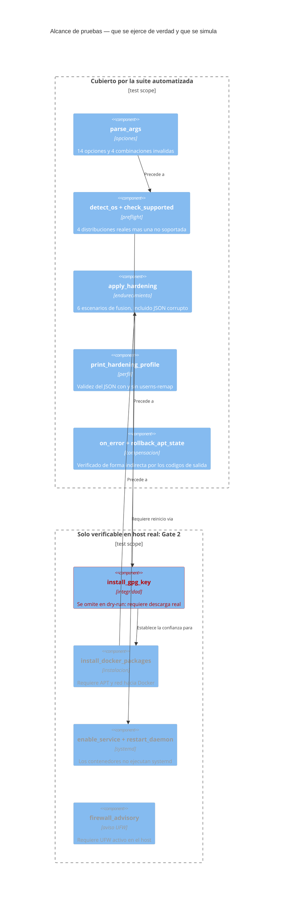
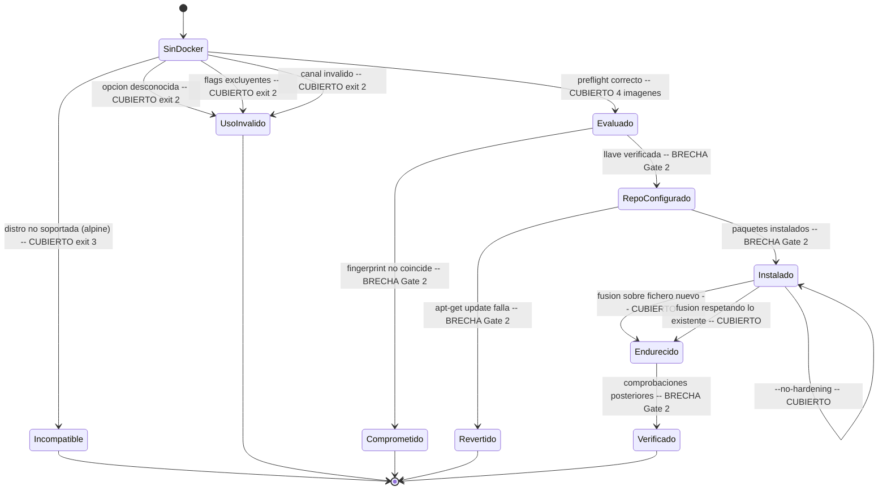
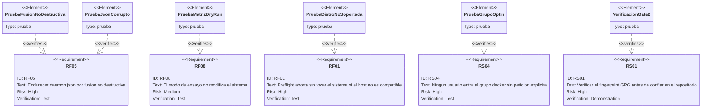

# Estrategia de pruebas

* **Estado:** review
* **Fecha:** 2026-08-30
* **Decisores:** Jeremi Alcala
* **Fase AI-DLC:** 04-testing
* **Versión:** 0.2.0
* **Gate:** 3
* **Alcance de la suite:** `install-docker.sh` y sus efectos en el host
* **Ejecución local:** `bash tests/run-all.sh`

## La pirámide, adaptada a un instalador

La pirámide clásica no encaja tal cual: aquí no hay clases que instanciar ni servicios que
levantar. Lo que sí hay es un gradiente equivalente, del más barato y rápido al más caro y
lento:

| Nivel | Qué prueba | Herramienta | Dónde corre | Coste |
|---|---|---|---|---|
| **Estático** | Sintaxis, quoting, expansiones inseguras | `bash -n`, ShellCheck | CI + local | Segundos |
| **Unitario** | Funciones aisladas con salida determinista | `tests/hardening-merge.sh` | Contenedor `python:3.12-slim` | Segundos |
| **Integración** | El script completo contra un SO real | `tests/dry-run-matrix.sh` | Contenedores Debian/Ubuntu | ~1 min |
| **Contrato** | Códigos de salida y ficheros escritos | Aserciones en la matriz + `release.yml` | CI | Segundos |
| **Seguridad** | Secretos, integridad del artefacto | gitleaks, checksum del release | CI | Segundos |
| **Sistema (E2E)** | Instalación real con paquetes y systemd | Manual en VM | Gate 2 | Minutos, requiere VM |

La base es ancha y automatizada; la cúspide es manual **por una razón estructural, no por
pereza**: verificar la instalación real exige systemd, red hacia `download.docker.com` y un
host desechable. Los contenedores no ejecutan systemd, así que hay un techo que la
automatización actual no atraviesa. Está declarado abajo como brecha conocida.

## Alcance de las pruebas sobre la arquitectura

*Caption — eje estructura, fase 04-testing: el límite entre lo que la suite ejerce de verdad y
lo que queda para el Gate 2. `install_gpg_key` se marca en rojo porque es el control de
seguridad más importante que **no** está cubierto automáticamente.*

## Pruebas de transición de estado

Las transiciones inválidas son las que cubren los escenarios de abuso: un instalador se rompe
en los caminos que nadie prueba.

*Caption — eje comportamiento, fase 04-testing: las transiciones marcadas BRECHA son las que
requieren un host real. Todas las que se pueden automatizar hoy, lo están.*

## Trazabilidad requisito ↔ prueba

Cierra el círculo abierto en el `requirementDiagram` del PRD (Gate 0).

*Caption — eje trazabilidad, fase 04-testing: cuatro de los cinco requisitos de riesgo alto
tienen prueba automatizada; RS01 queda con verificación por demostración en Gate 2.*

## Matriz OWASP Top 10:2025 × cobertura

| Riesgo | Aplica | Cómo se prueba | Estado |
|---|---|---|---|
| **A01** Broken Access Control | Sí (T5) | `dry-run-matrix.sh`: nadie entra al grupo sin `--docker-group` | ✅ Automatizado |
| **A02** Security Misconfiguration | Sí (T6, T7) | `hardening-merge.sh`: rotación de logs aplicada. Aviso de UFW: manual | ⚠️ Parcial |
| **A03** Software Supply Chain | Sí (T1, T2, T3, T9) | `release.yml` valida tag ↔ versión ↔ changelog. Fingerprint: Gate 2 | ⚠️ Parcial |
| **A04** Cryptographic Failures | Marginal | `curl --proto '=https' --tlsv1.2` en la descarga de la llave | ✅ Por construcción |
| **A05** Injection | Marginal | ShellCheck detecta expansiones sin comillas; sin entrada no confiable interpretada | ✅ Estático |
| **A06** Insecure Design | Sí | Threat model + ADRs revisadas en Gate 1 | ✅ Revisión |
| **A07** Identification/AuthN | No aplica | El instalador no autentica; delega en `sudo` | — |
| **A08** Data Integrity | Sí (T1, T2, T4) | `SHA256SUMS` en release; `main "$@"` revisado en PR | ⚠️ Parcial |
| **A09** Logging Failures | Sí (T11) | Bitácora implementada; **falta aserción automatizada** | ❌ Brecha |
| **A10** Exceptional Conditions | Sí (T4, T8, T10) | Códigos 2/3/4 verificados; JSON corrupto verificado | ✅ Automatizado |

## Estado actual de la suite

Ejecución del 2026-08-30 en Docker 29.5.2:

| Suite | Aserciones | Resultado |
|---|---|---|
| ShellCheck (`install-docker.sh` + 3 scripts de test) | — | Sin hallazgos |
| `dry-run-matrix.sh` (4 imágenes × 10 + alpine) | 41 | 41 pass · 0 fail |
| `hardening-merge.sh` | 14 | 14 pass · 0 fail |
| Validación Mermaid de `docs/` | 1 por diagrama | Todos válidos |

## Brechas conocidas y cómo se cierran

Se declaran de forma explícita porque un gate no se cierra ocultando lo que falta.

| Brecha | Impacto | Cómo se cierra | Gate |
|---|---|---|---|
| La verificación real del fingerprint GPG (RS01/T3) no se ejerce: `--dry-run` la omite | El control de seguridad más importante solo está revisado, no probado | Instalación real en VM + prueba negativa con una llave falsa servida localmente | 2 → 3 |
| systemd no se ejercita (enable, restart, `is-active`) | Los contenedores no lo ejecutan | Instalación real; opcionalmente imágenes con systemd o VM efímera en CI | 2 |
| La instalación real de paquetes no se prueba | El camino feliz principal | Instalación real en Debian 12 y 13 | 2 |
| Sin aserción sobre la bitácora (A09/T11) | No se verifica que se registre lo que se dice registrar | Añadir aserción en la instalación real: la bitácora contiene START, el fingerprint y END | 2 |
| `--docker-version` (pin) sin prueba | T9 mitigada pero no verificada | Prueba con una versión antigua conocida en VM | 3 |
| `--userns-remap` solo validado como JSON | Marcado experimental en el contrato | Prueba en VM antes de promoverlo a estable | 3 |
| Aviso de UFW sin prueba | T6, score 8.2 | VM con UFW activo; comprobar que aparece el aviso | 2 |

## Criterios de Gate 3

- [ ] Todas las brechas de la tabla anterior cerradas o reclasificadas con decisión humana.
- [ ] Prueba negativa de integridad: una llave GPG que no coincide **debe** producir código 4
      y dejar el host intacto.
- [ ] Instalación real verificada en Debian 12, Debian 13, Ubuntu 22.04 y Ubuntu 24.04.
- [ ] Prueba de convergencia: segunda ejecución sobre un host ya instalado no reinstala y
      respeta la configuración existente.
- [ ] Prueba de pin de versión con una versión no-última.
- [ ] CI en verde en las cinco tareas del workflow.
