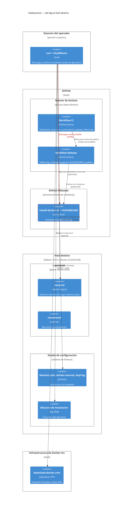
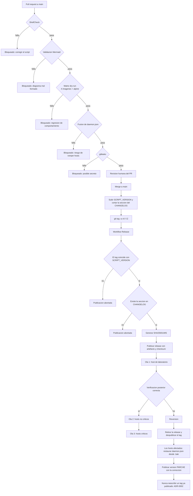
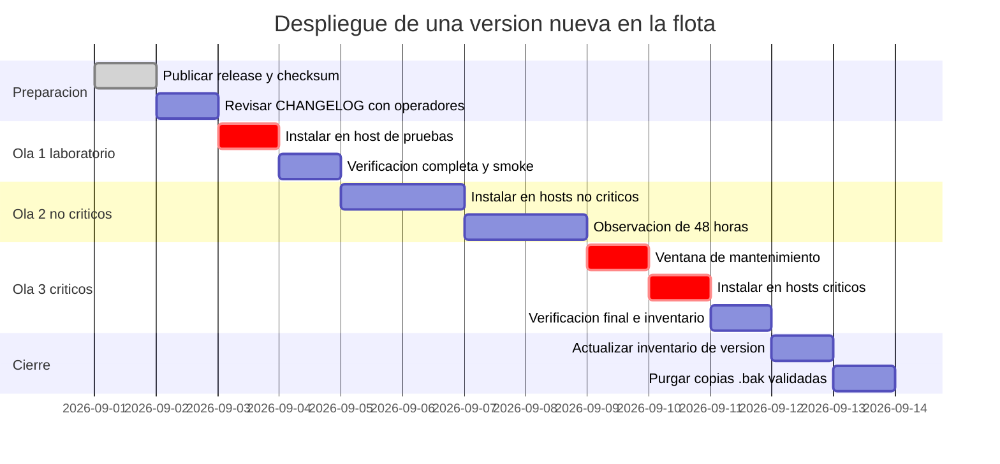

# Despliegue: publicación del artefacto y despliegue en la flota

* **Estado:** draft
* **Fecha:** 2026-08-30
* **Decisores:** Jeremi Alcala
* **Fase AI-DLC:** 05-deployment
* **Versión:** 0.2.0
* **Gate:** 4
* **Entorno objetivo:** GitHub Releases (artefacto) · servidores base Debian/Ubuntu de Higerotech (consumo)
* **Estrategia de release:** tags SemVer inmutables + despliegue en olas por criticidad

En este proyecto "desplegar" tiene dos significados que conviene no mezclar:

1. **Publicar el artefacto** — cortar un tag y que GitHub Releases sirva el script con su
   checksum. Es automático y lo hace `release.yml`.
2. **Desplegar en la flota** — que cada servidor ejecute el instalador. Es manual y por olas,
   porque cada ejecución toca un host en producción.

## Topología (C4 Deployment)

*Caption — eje estructura, fase 05-deployment: la única frontera con control criptográfico real
está entre el artefacto publicado y la estación del operador; el resto es confianza en TLS más
la firma de APT.*

## Pipeline de publicación y ruta de reversión

*Caption — eje comportamiento, fase 05-deployment: siete puertas antes de que un artefacto sea
descargable. La rama de reversión termina en la regla que sostiene ADR-0002 — un tag publicado
no se reescribe jamás; se publica uno nuevo.*

## Reversión: qué se puede y qué no

| Situación | Acción | Reversible |
|---|---|---|
| El artefacto publicado tiene un defecto y **nadie lo instaló aún** | Retirar la release, borrar el tag remoto, publicar PARCHE | Sí |
| El artefacto se instaló y **rompió el daemon** | Restaurar `daemon.json.bak.<ts>` en cada host afectado y reiniciar | Sí |
| El artefacto se instaló y **dejó `apt` roto** | No debería ocurrir (ADR-0008); si ocurre, §11 del runbook | Sí |
| El artefacto **instaló una versión errónea de Docker** | Desinstalar y reinstalar con `--docker-version` correcto | Sí, con parada de contenedores |
| Se añadió a alguien al grupo `docker` por error | `gpasswd -d <usuario> docker` + cerrar sus sesiones | Sí |
| Un tag comprometido **ya fue descargado y ejecutado** | **No reversible por el proyecto.** Es incidente de seguridad: reconstruir el host | **No** |

La última fila es el motivo de la existencia de ADR-0002 y del `SHA256SUMS`. Un instalador que
corre como root no tiene deshacer.

## Cutover: despliegue en la flota

*Caption — eje trazabilidad, fase 05-deployment: la observación de 48 horas entre la ola 2 y la
3 existe porque los efectos del endurecimiento (rotación de logs, `live-restore`) no se
manifiestan de inmediato, sino tras acumular actividad.*

## Criterios de Gate 4

- [ ] **Protección de rama `main` activada** en GitHub (sin push directo, PR obligatorio).
      Sin esto, ADR-0002 no se sostiene.
- [ ] **Protección de tags `v*`** activada (no se pueden reescribir ni borrar).
- [ ] Workflow `release.yml` ejecutado con éxito al menos una vez.
- [ ] `SHA256SUMS` publicado y verificado manualmente por un operador distinto del que publicó.
- [ ] Runbook validado ejecutándolo paso a paso en un host real.
- [ ] Ruta de reversión probada: restaurar `daemon.json` desde `.bak` en un host de pruebas.
- [ ] Inventario de la flota con versión de instalador y de Docker por host.
- [ ] `<TODO>` Definir quién es el aprobador de la ola 3 (hosts críticos).
