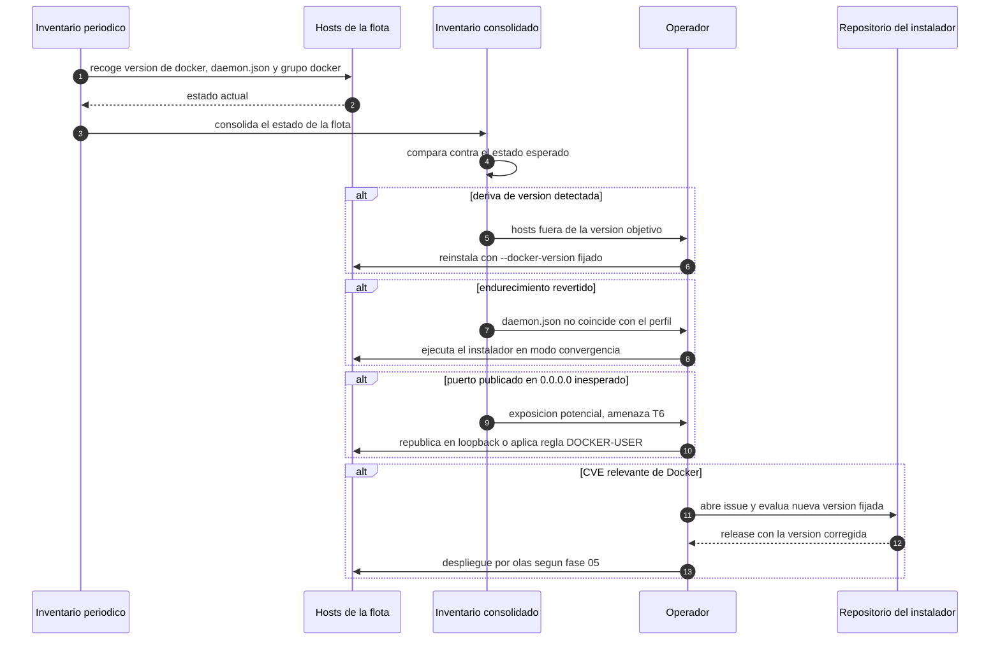
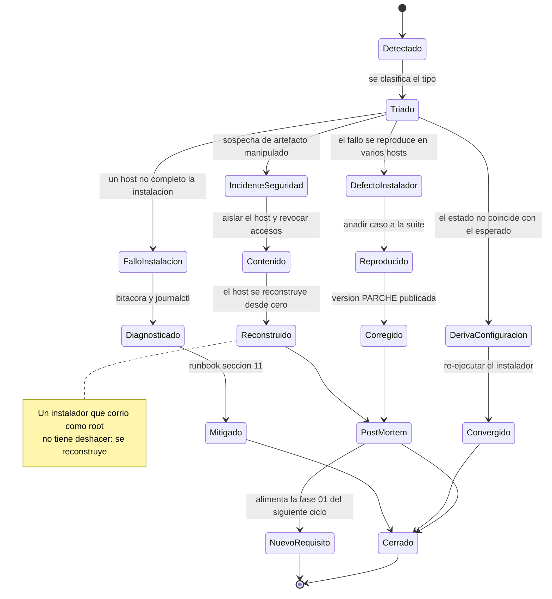
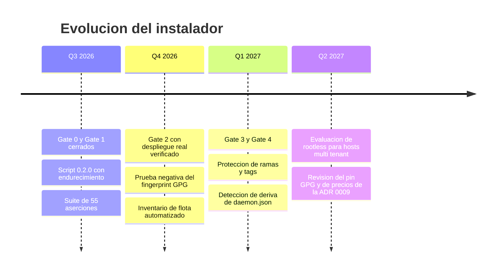

# Observabilidad y respuesta a incidentes

* **Estado:** draft
* **Fecha:** 2026-08-30
* **Decisores:** Jeremi Alcala
* **Fase AI-DLC:** 06-monitoring
* **Versión:** 0.2.0
* **Gate:** 5
* **SLOs (ref):** ver tabla de SLIs/SLOs de este documento
* **On-call:** `<TODO>` definir rotación; hoy es Jeremi

## Premisa: el instalador no observa nada, y es deliberado

El instalador **no envía telemetría**. No hay ping a un servidor de estadísticas, ni
identificador de host, ni contador de instalaciones. Es una decisión de diseño registrada en
`data-classification.md`: elimina toda una familia de amenazas de fuga y deja el alcance
regulatorio en prácticamente cero.

La consecuencia es que la observabilidad de este sistema **no es push, es pull**: el estado
vive distribuido en los hosts y hay que ir a buscarlo. Eso condiciona todo lo que sigue.

## Qué se observa y dónde vive

| Señal | Dónde vive | Cómo se recoge | Qué detecta |
|---|---|---|---|
| Resultado de cada instalación | `/var/log/instalador-docker-compose.log` en cada host | `ssh` + `tail`, o el gestor de configuración | Instalaciones fallidas, quién recibió acceso al grupo docker |
| Versión de Docker por host | `docker --version` | Inventario periódico | Deriva de versiones (T9) |
| Versión del instalador aplicada | Línea `START` de la bitácora | Inventario periódico | Hosts con versión antigua del instalador |
| Deriva de `daemon.json` | `/etc/docker/daemon.json` | Comparación contra el perfil esperado | Endurecimiento revertido a mano |
| Ocupación de disco por logs | `du -sh /var/lib/docker/containers` | Métrica del host | Que la rotación funciona (T7) |
| Puertos publicados en `0.0.0.0` | `docker ps --format` / `ss -tlnp` | Escaneo periódico | Exposición no intencionada (T6) |
| Avisos de seguridad de Docker | Docker Security Advisories | Suscripción | CVEs que exijan actualizar |
| Miembros del grupo docker | `getent group docker` | Inventario periódico | Concesiones de root no registradas (T5) |

## Flujo de una señal hasta la acción

*Caption — eje comportamiento, fase 06-monitoring: las cuatro ramas son los únicos motivos por
los que este sistema genera trabajo operativo. Tres de ellas terminan re-ejecutando el
instalador, que es justo lo que el modo convergencia habilita.*

## Ciclo de vida de un incidente

*Caption — eje comportamiento, fase 06-monitoring: la rama de incidente de seguridad termina en
reconstrucción, no en limpieza. La de defecto termina siempre añadiendo un caso a la suite —
es el bucle 06 → 01 de la metodología.*

## SLIs y SLOs

Estos objetivos son de un sistema de aprovisionamiento, no de un servicio en línea: no hay
disponibilidad que medir, hay **corrección y homogeneidad**.

| SLI | SLO | Ventana | Cómo se mide |
|---|---|---|---|
| Instalaciones que terminan con código 0 | ≥ 98% | Trimestre | Bitácoras de la flota |
| Hosts con la versión de Docker objetivo | 100% | Mensual | Inventario |
| Hosts con el perfil de endurecimiento íntegro | 100% | Mensual | Comparación de `daemon.json` |
| Hosts con puertos publicados en `0.0.0.0` sin justificar | 0 | Mensual | Escaneo |
| Miembros del grupo docker no registrados en bitácora | 0 | Trimestre | `getent` vs bitácoras |
| Tiempo desde CVE crítico de Docker hasta flota actualizada | ≤ 7 días | Por evento | Fecha del aviso vs inventario |

## Roadmap

*Caption — eje trazabilidad, fase 06-monitoring: la revisión del pin GPG y de los precios de la
ADR-0009 aparecen en el roadmap porque ambos tienen fecha de caducidad declarada.*

## Criterios de Gate 5

- [ ] Inventario de la flota automatizado (versión de Docker, versión del instalador, hash de
      `daemon.json`, miembros del grupo docker).
- [ ] Detección de deriva del perfil de endurecimiento con alerta al operador.
- [ ] Suscripción activa a los avisos de seguridad de Docker con responsable asignado.
- [ ] Proceso de incidentes documentado y ensayado al menos una vez.
- [ ] Rotación de la bitácora (logrotate) desplegada en toda la flota.
- [ ] `<TODO>` Definir la rotación de on-call.
- [ ] `<TODO>` Decidir la herramienta de inventario (Ansible ad-hoc, gestor de configuración o
      script propio) — condiciona el resto de criterios.
